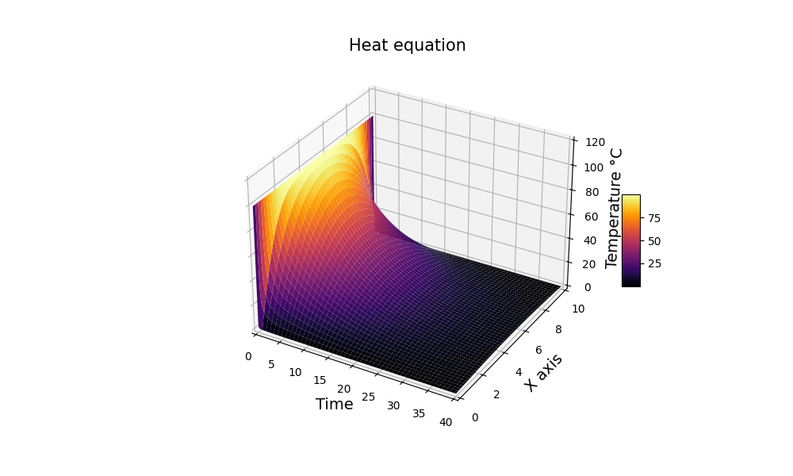
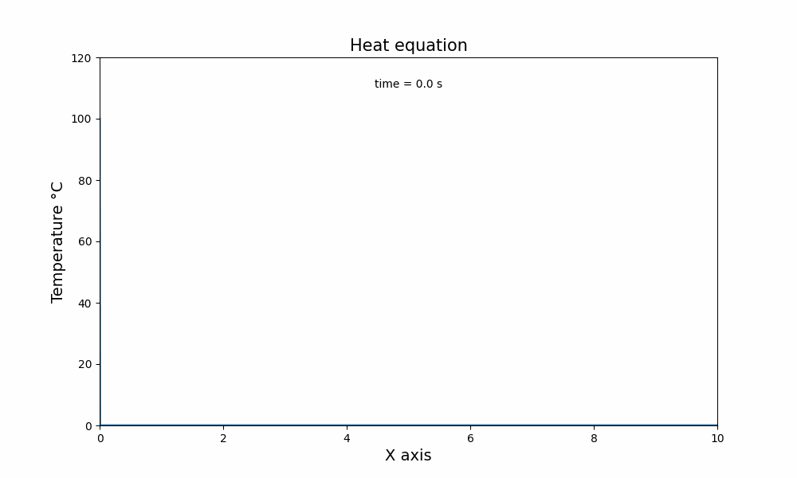
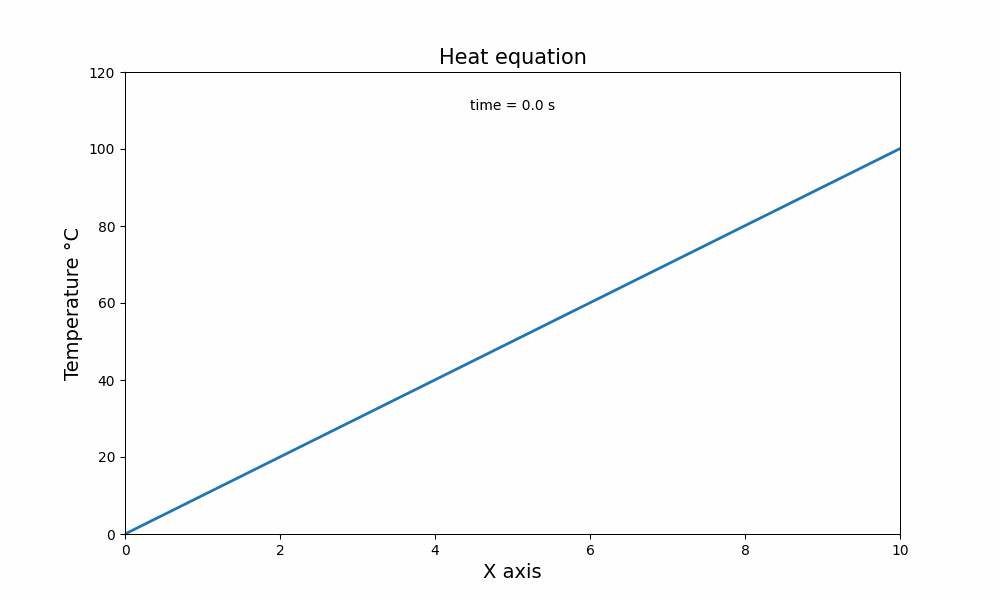
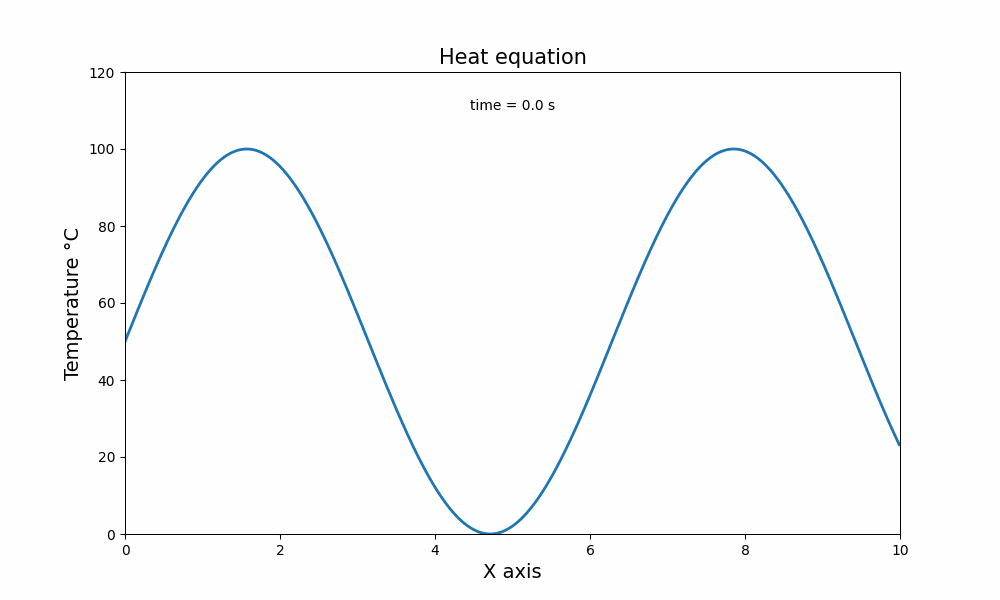
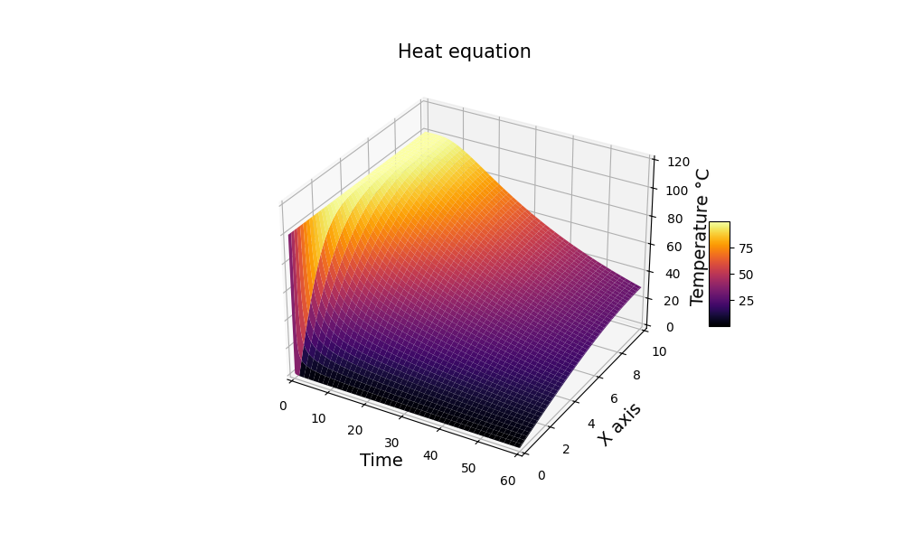
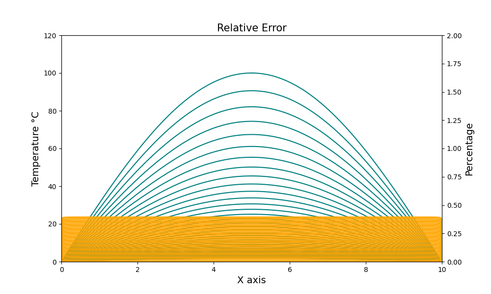
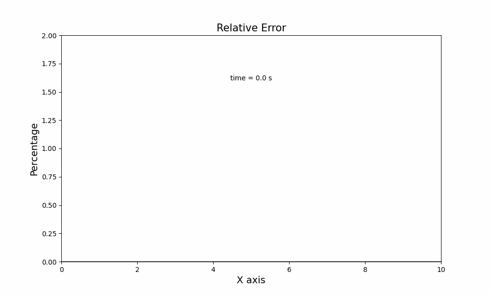

# Let's solve the heat equation with Linear Algebra!

 |
:-----------------------------:|

As this is part of my Linear Algebra courses final exam, I try to use most of the techniques learned so far by solving numerically the one and two-dimensional heat equations using python.
Basically we used only the difference matrix and its eigenvalues to resolve the PDE, wich is just the method of lines used by Gilbert Strang in his books.
We found that the overall error this method embeds is $<0.5%$ for a $dx$ discretization of about $0.005$, with even smaller percentage the smaller you make the $dx$ be.

Some different boundary conditions were added so you can also analize the diffusions behaviour in all its distinct aspects.

## Methodology

Basically in `create_difference_matrix()` we craft the second differences matrix and in `create_first_vector()` the initial temperature vector is set. Then, in `generate_solutions()` we return a matrix with all solutions solved by the [-1, 2, -1] matrix eigenvalues calculated at specific times that the user can choose.
Multiple plotting functions were also implemented.

## Code



Inside the `.\src\` directory you will find each module. Just run them and the equation with your usual boundary conditions will be solved, generating the images in `.\img\` and in  `.\gif\`.

For other boundaries or starting condition plots, change the function calls freely as this examples shows:

```python
D = create_difference_matrix("partial")         # "open", "partial" and "closed" rob supported
u = create_first_vector("linear")               # "linear", "sin", "constant" and "benchmark" vectors are possible

out = generate_solutions(D, u, 0.1)             # Control the dt size: here it is 0.1
generate_gif(out, "../gif/heat_1d_linear.gif")  # Save it anywhere you want, relatively to /src/
```

## Results

Below are the coolest animations we produced.

 | 
:----------------------------:|:-------------------------:
1D linear with open borders   |  1D sin with open borders

   | 
:-----------------------:|:------------------------------:
2D heatmap with f(x)=100 | 2D surface of the same case

Now some partial and closed boundaries.

 | 
:--------------------------------:|:-------------------------:
1D constant case closed partially only at x=10 | 1D sin closed at both sides

 | 
:---------------------------------------:|:--------------------------------------:
1D constant case plotted by time | 2D linear case with open boundaries

And now the error visualizations.

 | 
:--------------------------------------------:|:----------------------------:
Erros and temp. when dx=0.005 and dt=1 | Relative error changes through time